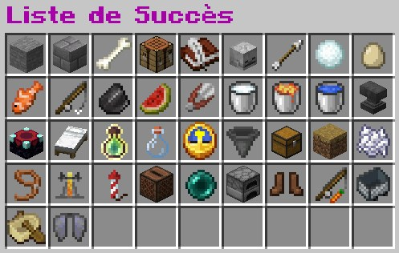
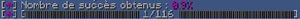
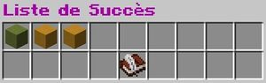
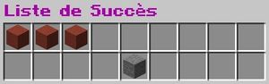
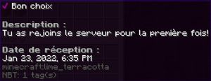

## Principe

Lorsque vous réalisez diverses actions sur le serveur, vous débloquez parfois des « advanced achievement ». Ceux-ci concernent des actions allant de la connexion au serveur jusqu’au nombre de morts en passant par la récolte de certains blocs ou la pêche par exemple.

Ces accomplissements vous permettent de gagner des récompenses financières et également de l’expérience pour votre niveau Irezia. Un classement général, mensuel et hebdomadaire est disponible afin de montrer aux autres que c’est vous le meilleur !

## Fonctionnement

Pour accéder au menu principal, utilisez la commande **/aach list**. Vous pouvez ensuite sélectionner la catégorie de votre choix.

En fonction de votre avancement, la terre cuite aura une couleur rouge, jaune ou verte. 

 Si vous n’avez pas encore réalisé cette action, elle sera en rouge et l’objectif sera masqué jusqu’à ce qu’il soit réalisé.

 Elle passera ensuite en jaune entre le moment où vous commencez ce type d’action et le moment où vous accomplissez la tâche puis deviendra verte et vous pourrez voir diverses informations à propos de celle-ci. 

  
 

Afin d’obtenir vos classements ou vos statistiques, utilisez les commandes suivantes :

 1. Classement hebdomadaire : /aach week

 2. Classement mensuel : /aach month

 3. Classement général : /aach top

 4. Vos statistiques : /aach stats