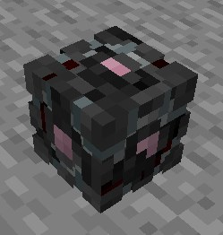

## Principe

 Les artéfacts sont des éléments mystérieux cachés dans la ville d’Opale, tant au centre-ville que dans les différents quartiers autour. Ils peuvent être absolument partout : dans l’eau, dans les arbres, au sol, dans des bâtiments ou encore uniquement accessible avec des enderpearls !

 A chaque artéfact trouvé, vous obtiendrez une récompense financière. En complément, vous gagnerez également des compétences particulières telle que de la vie, de la force, …

## Fonctionnement

Lorsque vous trouvez un artéfact, vous n’aurez qu’à faire un clic droit dessus.

