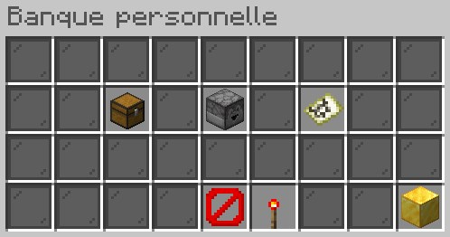
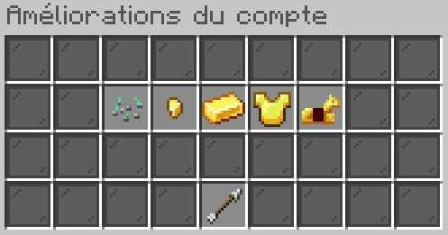

## Principe

 Accessible directement sur votre droite à votre arrivée au spawn du centre-ville d’Opale, la banque vous permettra de sécuriser votre argent mais également de gagner des intérêts sur vos placements.

 Votre compte en banque par défaut a cependant un plafond que vous pourrez augmenter en améliorant votre compte, ce qui vous permettra également de gagner plus d’intérêts.

## Fonctionnement

En parlant aux agents de l’accueil, il vous sera possible d’effectuer un dépôt, un retrait ou de consulter votre historique de transaction.

 L’amélioration de votre compte vous permettra de l’améliorer dans l’ordre suivant :  
 **Compte Débutant** -> **Gold** -> **Deluxe** -> **Super Deluxe** -> **Première**.  
 
 Chaque amélioration augmentera le plafond maximal et débloquera des intérêts sur une tranche d’argent déposé plus importante. Attention à ce que vous devez obligatoirement débloquer tous les comptes précédents avant le suivant.

