# COLLECTIONS

Le système de collections vous permet de débloquer diverses récompenses (recettes d’objets, familiers, enchantements personnalisés, …) après avoir récolté divers objets.  
Plus vous récoltez un objet, plus vous avancerez au sein de sa collection et débloquerez de nouveaux paliers et donc des récompenses.

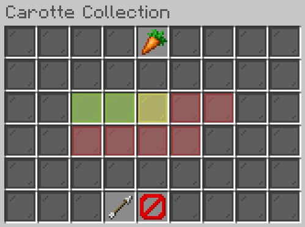

 Il y a un total de 8 catégories : Agriculteur, Boucher, Mineur, Terraformeur, Combattant, Bucheron, Pêcheur, Event. Chaque catégorie reprend la majorité des objets vanilla de Minecraft associés.

 Pour accéder au menu principal, il suffit d’utiliser la commande `/irmenu` et de sélectionner le sous-menu `Collections`, vous pourrez ensuite naviguer à votre guise à travers les différents sous-menus.

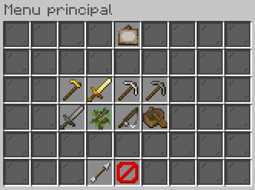

 Vous pouvez également connaître votre classement dans chaque collection en cliquant sur le tableau dans le menu principal.  

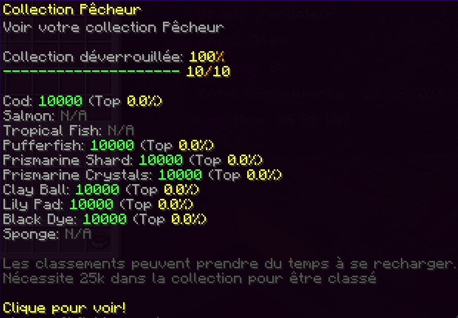

## AGRICULTEUR
*Cette catégorie regroupe les cultures*  

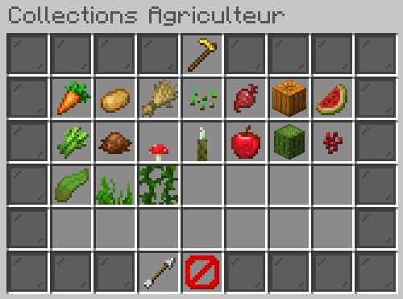

|                   ||  Objets dans la collection       ||                                                  |
| :---------------: || :-----------------------:        ||                                                  |
| :minecraft-16x-item-carrot: Carotte                      ||  :minecraft-16x-item-sugar_cane: Canne à sucre      || :minecraft-16x-block-seagrass: Herbe aquatique   |
| :minecraft-16x-item-potato: Patate                       ||  :minecraft-16x-item-cocoa_beans: Cacao             || :minecraft-16x-block-vine: Vigne                 |
| :minecraft-16x-item-wheat: Blé                           ||  :minecraft-16x-block-red_mushroom: Champi rouge    || :minecraft-16x-item-kelp: Kelp                   | 
| :minecraft-16x-item-wheat_seeds: Graine de blé           ||  :minecraft-16x-item-sea_pickle: Cornichon          || :minecraft-16x-item-nether_wart: Nether Wart     |
| :minecraft-16x-block-carved_pumpkin: Citrouille          ||  :minecraft-16x-item-apple: Pomme                   || :minecraft-16x-block-cactus_side: Cactus         | 
|                                                       ||  :minecraft-16x-item-melon_slice: Melon

## BOUCHER

<IMAGE MENU BOUCHER>
*Cette catégorie regroupe les viandes et les butins associés*  

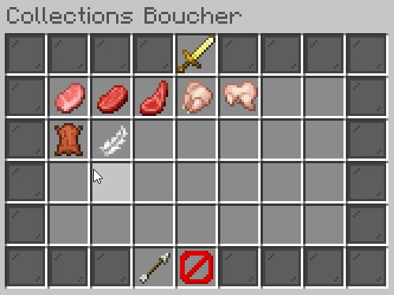

|                   ||  Objets dans la collection       ||                                                  |
| :---------------: || :-----------------------:        ||                                                  |
| :minecraft-16x-item-porkchop: Porc Cru                   ||  :minecraft-16x-item-mutton: Moutton Cru            || :minecraft-16x-item-rabbit: Lapin Cru             |
| :minecraft-16x-item-beef: Boeuf Cru                      ||  :minecraft-16x-item-chicken: Poulet Cru            || :minecraft-16x-item-leather: Cuir                 |
|                                                       ||  :minecraft-16x-item-feather: Plume                 ||                                                |    

## MINEUR

<IMAGE MENU MINEUR>
*Cette catégorie regroupe les minerais*  

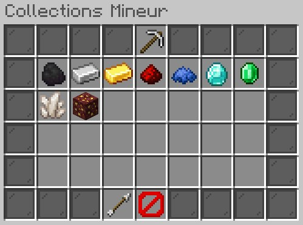

|                   ||  Objets dans la collection        ||                                            |
| :---------------: || :-----------------------:         ||                                            |
| :minecraft-16x-item-coal: Charbon                         ||  :minecraft-16x-item-sugar_cane: Diamant      || :minecraft-16x-block-nether_gold_ore: Or du Nether      |
| :minecraft-16x-item-iron_ingot: Fer                       ||  :minecraft-16x-item-cocoa_beans: Emeraude    || :minecraft-16x-item-lapis_lazuli: Lapis                 |
| :minecraft-16x-item-gold_ingot: Or                        ||  :minecraft-16x-block-red_mushroom: Quartz    || :minecraft-16x-item-redstone: Redstone                  |  

## TERRAFORMEUR

<IMAGE MENU TERRAFORMEUR>
*Cette catégorie regroupe les blocs à terraformer*

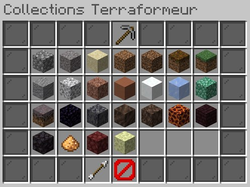

|                   ||  Objets dans la collection      ||                                                            |
| :---------------: || :-----------------------:       ||                                                            |
| :minecraft-16x-block-cobblestone: Cobblestone           ||  :minecraft-16x-block-andesite: Andesite                      || :minecraft-16x-block-soul_soil: Soul Soil              |
| :minecraft-16x-block-gravel: Gravier                    ||  :minecraft-16x-block-terracotta: Terracotta                  || :minecraft-16x-block-soul_sand: Soul Sand              |
| :minecraft-16x-block-sand: Sable                        ||  :minecraft-16x-block-snow: Neige                             || :minecraft-16x-block-magma: Bloc de magma              | 
| :minecraft-16x-block-dirt: Terre                        ||  :minecraft-16x-block-ice: Glace                              || :minecraft-16x-block-nether_bricks: Brique du nether   |
| :minecraft-16x-block-coarse_dirt: Terre stérile         ||  :minecraft-16x-block-prismarine: Bloc de prismarine          || :minecraft-16x-block-blackstone: Blackstone            |
| :minecraft-16x-block-podzol_top: Podzol                 ||  :minecraft-16x-block-mycelium_top: Mycelium                  || :minecraft-16x-item-glowstone_dust: Glowstone          | 
| :minecraft-16x-block-grass_block_top: Herbe             ||  :minecraft-16x-block-obsidian: Obsidienne                    || :minecraft-16x-block-netherrack: Netherrack            |
| :minecraft-16x-block-diorite: Diorite                   ||  :minecraft-16x-block-basalt_top: Basalte                     || :minecraft-16x-block-end_stone: Pierre de l'end        |
|                                                      ||  :minecraft-16x-block-granite: Granite                        ||                                                     | 

## COMBATTANT

<IMAGE MENU COMBATTANT>
*Cette catégorie regroupe les butins de monstres*

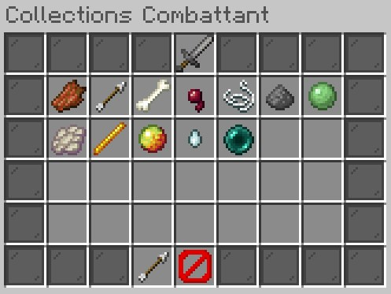

|                   ||  Objets dans la collection  ||                                                            |
| :---------------: || :-----------------------:   ||                                                            |
| :minecraft-16x-item-rotten_flesh: Viande de zombie  ||  :minecraft-16x-item-string: Ficelle                          || :minecraft-16x-item-blaze_rod: Baton de blaze          |
| :minecraft-16x-item-arrow: Flèche                   ||  :minecraft-16x-item-gunpowder: Poudre de creeper             || :minecraft-16x-item-magma_cream: Crème de magma              |
| :minecraft-16x-item-bone: Os                        ||  :minecraft-16x-item-slime_ball: Boule de slime               || :minecraft-16x-item-ghast_tear: Larme de ghast               |  
| :minecraft-16x-item-spider_eye: Oeil d'arraigné     ||  :minecraft-16x-item-phantom_membrane: Membrane de phantom    || :minecraft-16x-item-enderpearl: Enderpearl                   |  

## BUCHERON

<IMAGE MENU BUCHERON>
*Cette catégorie regroupe les buches d’arbres*

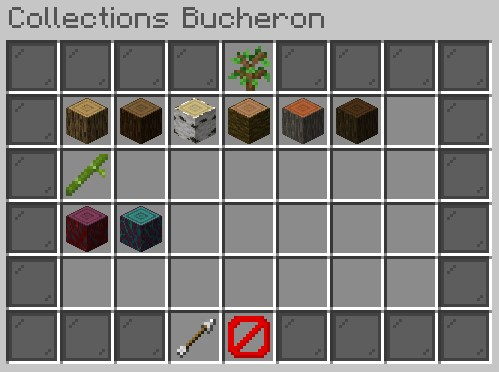

|                   ||  Objets dans la collection     ||                                                           |
| :---------------: || :-----------------------:      ||                                                           |
| :minecraft-16x-block-oak_log: Bûche de chêne           ||  :minecraft-16x-block-acacia_log: Bûche d'acacia             || :minecraft-16x-item-bamboo: Bambou          |
| :minecraft-16x-block-dark_oak_log: Bûche de chêne noir ||  :minecraft-16x-block-spruce_log: Bûche de sapin             || :minecraft-16x-block-warped_stem: Tige tortueuse          |
| :minecraft-16x-block-birch_log: Bûche de bouleau       ||  :minecraft-16x-block-jungle_log: Bûche de jungle            || :minecraft-16x-block-crimson_stem: Tige pleureuse         |  

## PECHEUR

<IMAGE MENU PECHEUR>
*Cette catégorie regroupe les poissons et les trésors*

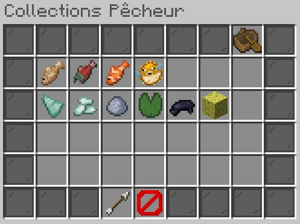

|                   ||  Objets dans la collection  ||                                                                 |
| :---------------: || :-----------------------:   ||                                                                 |
| :minecraft-16x-item-cod: Poisson                    ||  :minecraft-16x-item-pufferfish: Poisson globe                     || :minecraft-16x-block-lily_pad: Nénuphare             |
| :minecraft-16x-item-salmon: Saumon                  ||  :minecraft-16x-item-prismarine_shard: Eclat de prismarine         || :minecraft-16x-item-ink_sac: Poche d'encre           |
| :minecraft-16x-item-tropical_fish: Poisson tropical ||  :minecraft-16x-item-prismarine_crystals: Crystal de prismarine    || :minecraft-16x-item-clay_ball: Boule de clay         |  
|                                                  ||  :minecraft-16x-block-sponge: Eponge                               ||                                                   |  

## EVENT

<IMAGE MENU EVENT>
*Cette catégorie contient la collection générale des Events*

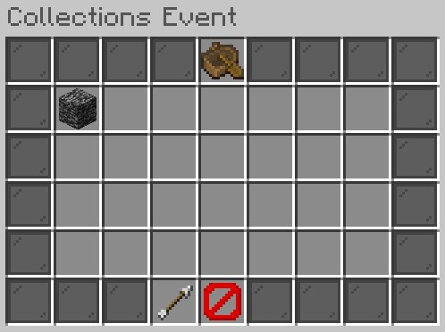

|                   ||  Objets dans la collection  |||
| :---------------: || :-----------------------:   |||
|                   ||             ??              |||