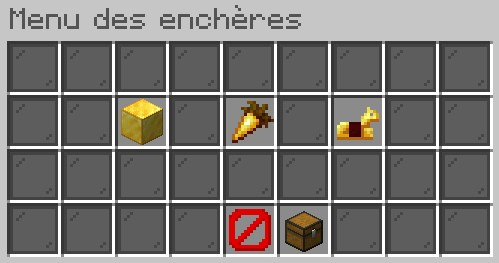
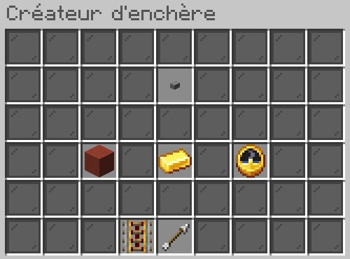
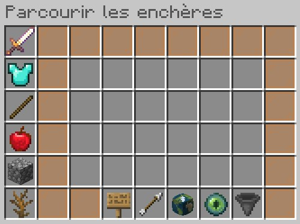
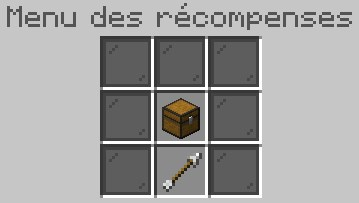

## Principe

Vous ne souhaitez pas vendre vos objets aux prix des shops ou bien vendre des objets invendables dans les shops ? Vous pouvez alors les mettre aux enchères dans l’Hôtel des ventes.

## Fonctionnement

### Créer une enchere

Pour mettre en vente un objet, vous devez parler à un Maitre des enchères dans l’Hôtel des ventes. Au moyen du bouton « Gérer les enchères », vous pouvez créer une enchère en définissant le prix de départ et le temps de l’enchère.

 Plus le prix de départ est élevé et le temps d’enchère long, plus les frais seront élevés.

Vous pouvez également décider de les mettre en vente à un prix fixe avec l’option « BIN ». Le premier joueur à y mettre le prix récupère l’objet.

### Participer à une enchere

Au moyen du bouton « Parcourir les enchères », vous pouvez naviguer entre catégories ou utiliser les options générales : faire une recherche, définir un filtre ou trier les enchères.

### Gerer une enchere

Au moyen du bouton « Afficher les offres », vous pouvez voir toutes vos offres en cours.

### Récupérer une enchere :

Au moyen du bouton « Récompenses », vous pouvez récupérer toutes vos offres gagnantes.