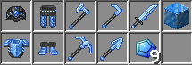
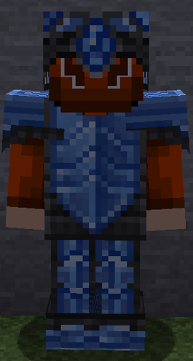
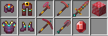
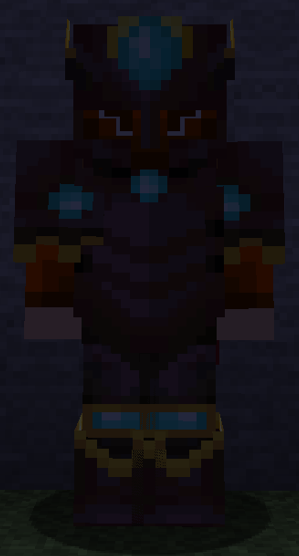
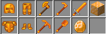
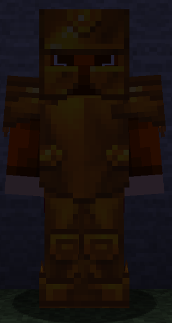

=== "Petrovite"
    1. Où le trouver ? 
        * Dans le Nether.
        * De la couche 1 à 100
    2. Comment le récupérer ?
        * Ce minerai est uniquement minable avec une pioche en Cinabre pour le récupérer.
    3. Quelle est sa puissance ?
        * Le Petrovite est le meilleur minerai du serveur. Il permet de réaliser des armes/armures/outils plus durables et plus puissant !
      
    
=== "Cinabre"
    1. Où le trouver ? 
        * Dans le [monde ressource](ressources.md).
        * De la couche 1 à 8.
    2. Comment le récupérer ?
        * Ce minerai est uniquement minable avec une pioche en Topaze pour le récupérer.
    3. Quelle est sa puissance ?
        * Le Cinabre est le deuxième meilleur minerai du serveur. Il permet de réaliser des armes/armures/outils plus durables et plus puissant que le Topaze !
      
    
=== "Topaze"
    1. Où le trouver ? 
        * Dans le [monde ressource](ressources.md).
        * De la couche 1 à 16.
    2. Comment le récupérer ?
        * Ce minerai est uniquement minable avec une pioche en Diamant pour le récupérer.
    3. Quelle est sa puissance ?
        * Le Topaze est le troisème meilleur minerai du serveur. Il permet de réaliser des armes/armures/outils plus durables et plus puissant que le diamant !
      
    