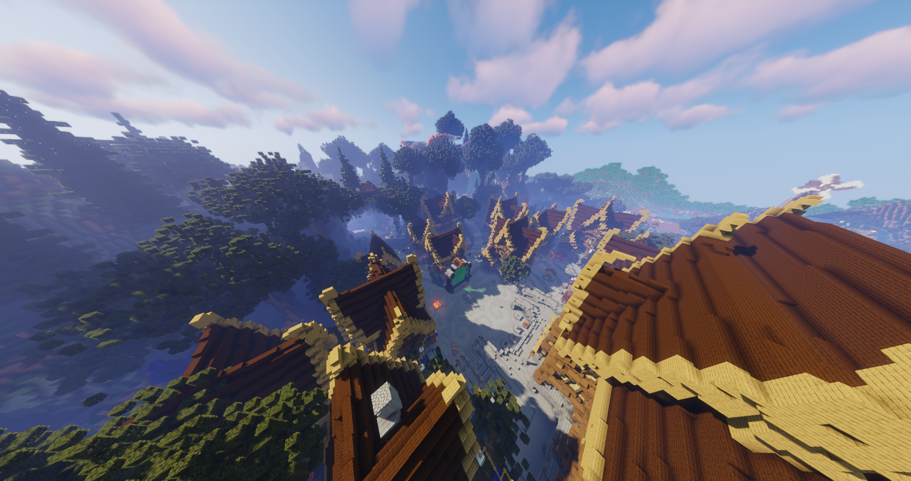
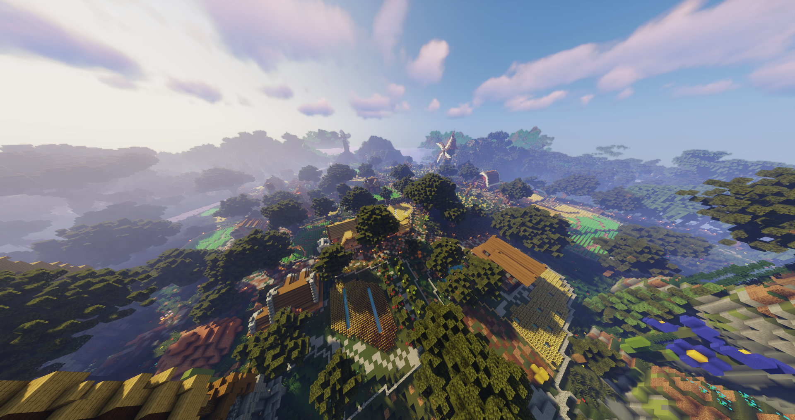
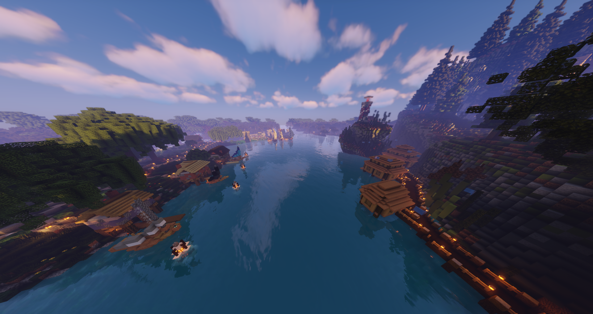
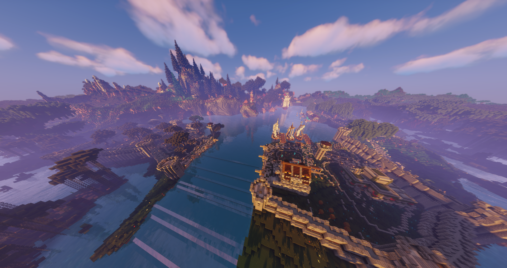
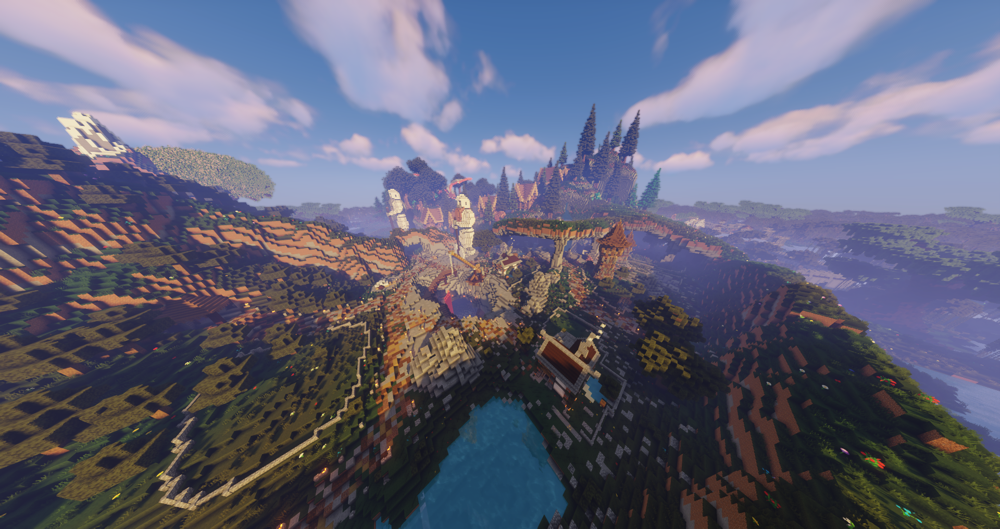
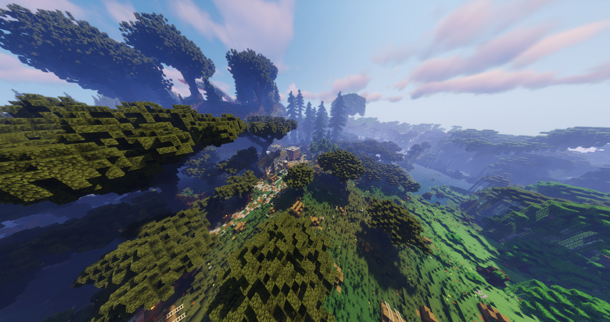

## VILLE STAFF - Opale

Au début de votre aventure, après votre passage par la zone débutant, vous arriverez directement dans la ville gérée par le Staff d’Irezia : **Opale.**

Au sein de cette ville, vous découvrirez plusieurs zones principales : 

* Centre-ville

* Quartier agriculteur

* Quartier pêcheur

* Quartier militaire

* Quartier mineur

* Quartier bucheron 

* Divers zones secondaires

    * port

    * étang

    * ...

S’agissant de la ville Staff, vous pourrez y trouver tous les bâtiments nécessaires pour une expérience de jeu optimale : 

* Palais

* Banque

* Hôtel de Vente

* Marché

* Forge

* Enchanteur

* ...

### **Centre-ville**
Zone centrale de la ville d’Opale. Présence de tous les bâtiments administratifs.

Parcelles locatives : 40 appartements à louer par les nouveaux arrivants à des prix abordables
 

### **Quartier agriculteur**

Situation : nord-ouest

Parcelles locatives : préconstruites ou à construire sous forme d’un grand champ récoltable

Bonus : zone de récolte avec repousse automatique à l’ouest du quartier

### **Quartier pêcheur**

Situation : nord

Parcelles locatives : préconstruites ou à construire soit sous forme de cabanes dans l’eau proche du port, soit sous forme de petites cabanes de pêcheur au bord de l’eau, soit sous forme plus traditionnelle, sur la terre ferme

Bonus : possibilité de pêcher directement à côté de votre logement

### **Quartier militaire**

Situation : nord-est et est

Parcelles locatives : possibilité de louer dans le quartier nord ou sud par rapport au canal menant à l’océan. Toutes les parcelles sont préconstruites mais certaines de façon simpliste pour laisser libre cours à votre imagination

Bonus : à proximité direct de la cave à monstres 

### **Quartier mineur**

Situation : sud-est

Parcelles locatives : préconstruites ou à construire soit en surface, soit directement dans la mine

Bonus : divers minerais de toute sorte apparaîtront par moment dans la mine

### **Quartier Bucheron**

Situation : sud-ouest

Parcelles locatives : préconstruites ou à construire, soit en surface, soit sous forme de cabanes dans les arbres

Bonus : zone de récolte de chaque type d’arbres avec repousse automatique au sud-ouest du quartier

## **VILLE JOUEUR**

Dans un avenir proche, il vous sera possible de créer votre propre ville que vous gérerez complètement. Vous choisirez sa localisation, son thème, son contenu, …

Plus de détails à venir … 