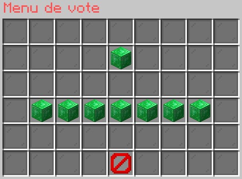

## Principe

Pour augmenter la visibilité et donc la population d’Irezia, vos votes sont primordiaux !

 C’est pourquoi nous avons facilité cette tâche au maximum en mettant en place un menu en jeu permettant d’avoir un accès facile à chaque site de vote.

 Pour chaque vote, vous obtiendrez quelques points votes que vous pourrez ensuite échanger via un menu en jeu contre des clés de boîtes vous attribuant des récompenses alléchantes !

 Via le scoreboard, vous aurez également un rappel vous permettant de savoir si vous pouvez à nouveau voter ainsi que le nombre de points/clés vote en votre possession.

## Fonctionnement

Accès au menu vote : **/irmenu** -> **V/ote**

Accès au menu d’échanges de point vote : **/irmenu** -> **Echange points vote**